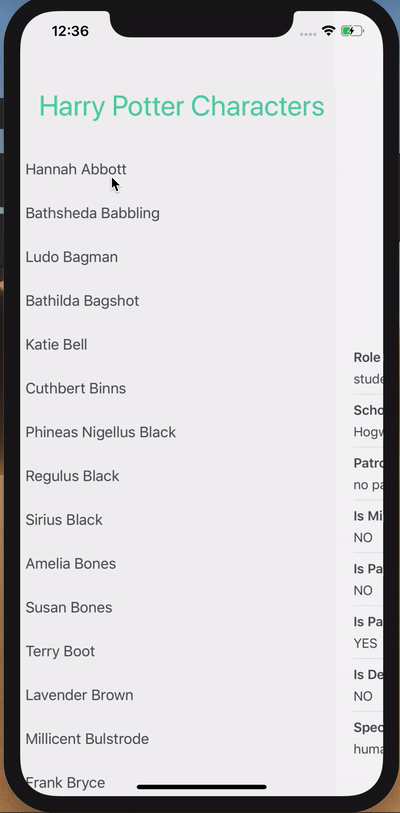

# Harry Potter App - iOS

This repository contains an iOS app that displays Harry Potter's characters:

-   The main view displays list of characters names.
-   When clicking a certain character name, the character's detail view is shown.

Harry Potter characters are fetched from the [Potter API](https://www.potterapi.com/)

## Architecture

This project was built using MVVM architecture

## Dependencies

This project uses Swift Package Manager to manage dependencies.

-   [Alamofire](https://github.com/Alamofire/Alamofire) to fetch Harry Potter's characters from the API
-   [PromiseKit](https://github.com/mxcl/PromiseKit) to handle asynchronous code
-   [Cuckoo](https://github.com/Brightify/Cuckoo) for mocking objects in Swift [only for the test target]

If the dependencies have not been resolved you can:

-   Run `xcodebuild -resolvePackageDependencies` in the terminal
-   Or in Xcode go to `File -> Swift Packages -> Resolve Package Versions`

## How to run

1. Open `HarryPotterApp.xcodeproj`
1. Execute the following command: 
   
   `curl -Lo run https://raw.githubusercontent.com/Brightify/Cuckoo/master/run && chmod +x run`
1. Open `AppDelegate.swift` file and set your api key. You can get your api key by registering on the [Potter API](https://www.potterapi.com/)
1. Run the app.

If you get any errors about dependencies, make sure you have resolved them first (see [Dependencies section](#Dependencies))
